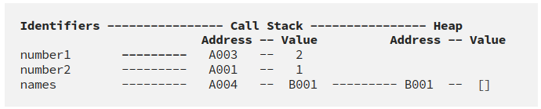

## Call Stack e Memory Heap

### Call Stack
- Aqui que os dados primitivos são armezenados.
- Armazena dados de endereço no Memory Heap
- First in Last Out.

```js
let number1 = 1; // Aloca em um endereço de memoria (ex: A0001) e guarda o valor 1
let number2 = number1; // Informa que a referencia à A0001 (valor: 1) é tb number2

number1 = number1 + 1; // Se tratando de um dado primitivo, q é imutável, não é possível substituir o valor de A0001 para 2, logo é criado um novo endereço A0002 com o valor 2 e esse endereço é associado ao number1.

console.log(number2); // Resultado: 1
// Como o number2 é referenciado ao A0001 (valor: 1) ele ainda é 1;
```  

### Memory Heap
- Armazena dados não primitivos
- Pode armazenar dados não ordenados que crescem dinamicamente (ex: array e objetos)


### Observaçoes
- Vale notar que quando colocamos `const` numa declaraçao de variável, nao estamos dizendo que o valor nao pode mudar, mas que o endereço de memória nao pode.
- Para os casos de `const` em não primitivos, é possível fazer algumas operaçoes (ex: push) pois não é trocado o endereço de memória e sim o valor no Memory Heap:

### Referências
- https://levelup.gitconnected.com/understanding-call-stack-and-heap-memory-in-js-e34bf8d3c3a4