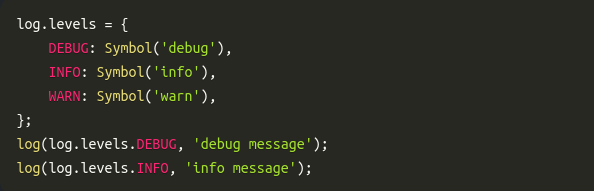
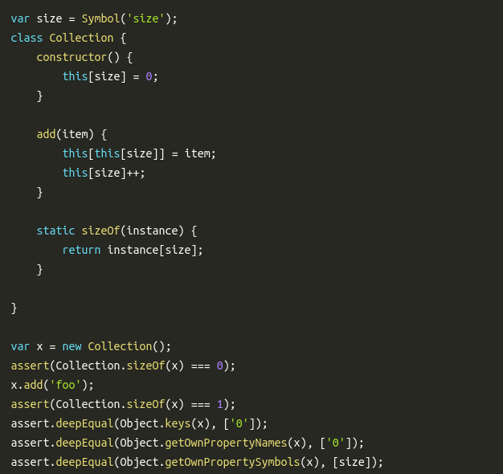

# Symbols

### O que são?
- Um tipo primitivo introduzido no ES6, sendo imutável e usado como identificador único para propriedades de objetos.

### Pra que Symbols são bons?
- Como um valor unico onde voce normalmente usaria String ou Int.

- Como um local para colocar valores metadata em um Objeto

### Referencias
- https://www.keithcirkel.co.uk/metaprogramming-in-es6-symbols/
- https://blog.risingstack.com/async-iterators-in-node-js/