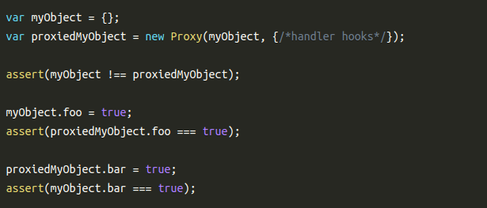

# Proxy
Proxy é um novo construtor global (como `Date` ou `Number`) no qual você passa um Objeto, um monte de hooks, e ele cospe um novo Objeto que envolve o antigo com todos esses ganchos sofisticados.

### Criando Proxies
- Um ponto importante na criação de proxies é que elas guardam a referencia do objeto que foi adicionado, logo se esse objeto for alterado/manipulado, essas mudanças afetam o objeto gerado na `Proxy`, e o contrário também é verdade!

### Referencias
- https://www.keithcirkel.co.uk/metaprogramming-in-es6-part-3-proxies/